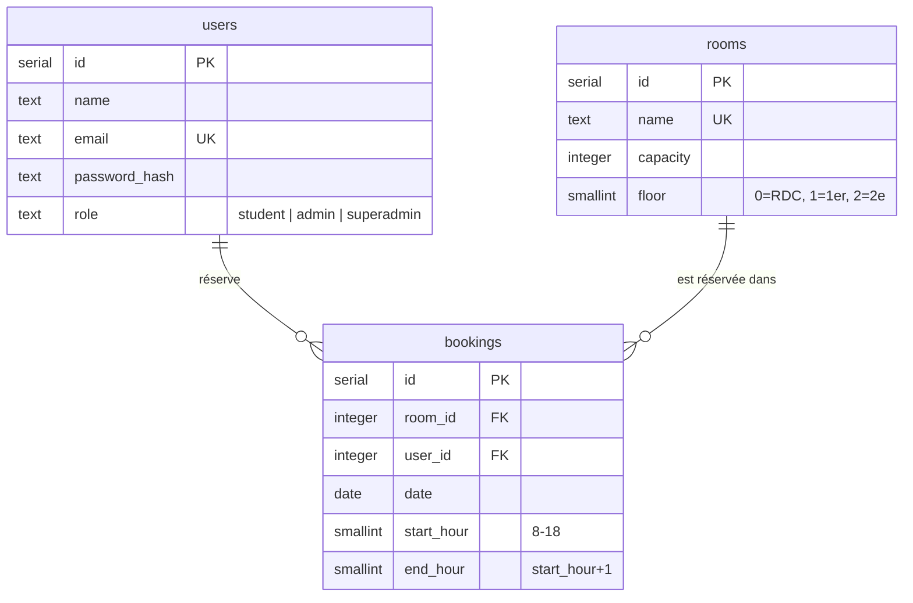

# FreeRoom

Voir quelles salles de l'école sont libres à un instant donné et réserver un créneau court, sans tourner dans les couloirs.

Projet étudiant (ESGI, Tech Venture Sprint). Une seule fonctionnalité de bout en bout, poussée jusqu'au bout : connexion, grille des salles avec créneaux libres/occupés du jour (mise à jour automatique toutes les 8s, créneaux passés non réservables), réservation, annulation — plus une gestion de rôles pour la modération (admin/superadmin).

---

## Sommaire

- [Fonctionnalités](#fonctionnalités)
- [Stack technique](#stack-technique)
- [Architecture](#architecture)
- [Modèle de données](#modèle-de-données)
- [Rôles et permissions](#rôles-et-permissions)
- [Structure du projet](#structure-du-projet)
- [Démarrer en local](#démarrer-en-local)
- [Scripts disponibles](#scripts-disponibles)
- [Tests](#tests)
- [Thème clair / sombre / auto](#thème-clair--sombre--auto)
- [Déploiement](#déploiement)
- [Sauvegarde et restauration](#sauvegarde-et-restauration)
- [Scénario d'incident](#scénario-dincident-base-coupée-en-plein-fonctionnement)
- [Hors périmètre (volontairement)](#hors-périmètre-volontairement)

---

## Fonctionnalités

- **Authentification** email + mot de passe (pas d'OAuth/SSO), session en cookie signé, rate limiting anti-bruteforce sur `/login` et `/signup`.
- **Grille du jour** : les salles réparties sur 3 étages (voir plus bas), 11 créneaux horaires (8h–19h), un sélecteur d'étage, navigation jour précédent/suivant. Rafraîchissement automatique toutes les 8s pour ne pas afficher un créneau comme libre alors qu'il vient d'être pris.
- **Réservation / annulation** en un clic, avec double-booking impossible *par construction* (contrainte unique en base, pas juste une vérification côté client).
- **"Mes réservations"** : liste des créneaux à venir de l'utilisateur connecté, avec annulation directe.
- **Rôles** : `student` (par défaut), `admin` (peut forcer une réservation sur un créneau déjà pris), `superadmin` (en plus, accès à un dashboard pour gérer le rôle de tous les comptes).
- **Thème clair / sombre / automatique**, mémorisé, sans flash au chargement.
- **Responsive** : pensé mobile d'abord (usage réel = un téléphone, entre deux cours, dans un couloir).

## Stack technique

| Domaine | Choix |
|---|---|
| Framework | **Next.js 16** (App Router), **React 19**, TypeScript |
| Base de données | **PostgreSQL** (choisi pour permettre `pg_dump`/`pg_restore`, voir [Sauvegarde](#sauvegarde-et-restauration)) |
| Accès base | **postgres.js**, SQL brut — pas d'ORM |
| Auth | Session cookie signée (JWT via `jose`), mots de passe hashés (`bcryptjs`), rate limiting maison |
| Style | Tailwind CSS v4, système de design documenté dans `DESIGN.md` |
| Tests | Vitest (unitaires + intégration HTTP réelle) |
| Icônes | `lucide-react` |

Aucun framework d'UI, d'ORM ou de state management externe — le projet reste volontairement petit et lisible de bout en bout.

## Architecture

**Frontend** — Server Components par défaut (le rendu des pages passe par la base à chaque requête, pas de cache client à invalider). Les seuls Client Components sont ceux qui ont vraiment besoin d'interactivité : les boutons réserver/annuler/forcer (`book-slot-button.tsx`, `cancel-slot-button.tsx`), le sélecteur de rôle du dashboard (`admin/role-select.tsx`), le bouton de thème (`theme-toggle.tsx`) et le rafraîchissement automatique (`live-refresher.tsx`). Les mutations passent soit par une **Server Action** (formulaires d'auth, changement de rôle), soit par un petit **Route Handler REST** (`/api/bookings`) pour les boutons qui ont besoin d'un état de chargement/erreur fin.

**Backend** — Toute la logique métier (créneaux valides, conflits, annulation autorisée) vit dans `lib/bookings.ts`, testée indépendamment de toute route HTTP. L'autorisation est **toujours revérifiée côté serveur**, jamais seulement cachée côté UI : un étudiant ne peut annuler que sa propre réservation (403 sinon), et le statut admin est relu en base à chaque action sensible plutôt que fait confiance depuis un token client.

**Protection des routes** — `proxy.ts` (le nom historique de `middleware.ts` dans ce projet) redirige vers `/login` toute page non publique sans session valide, et redirige un utilisateur déjà connecté loin de `/login`/`/signup`.

**Résilience** — `app/error.tsx` capte une base injoignable et affiche un message clair avec un bouton "Réessayer", plutôt qu'un crash ou une page blanche (voir le [scénario d'incident](#scénario-dincident-base-coupée-en-plein-fonctionnement)).

## Modèle de données



Le double-booking est rendu impossible par une contrainte `UNIQUE (room_id, date, start_hour)` — pas seulement une vérification applicative qu'une race condition pourrait contourner.

**Salles** : 35 au total, réparties par étage —
- **RDC** (`floor = 0`) : l'Amphi + Salle 001 à 010
- **1er étage** (`floor = 1`) : Salle 101 à 112
- **2e étage** (`floor = 2`) : Salle 201 à 212

## Rôles et permissions

| Rôle | Peut faire |
|---|---|
| `student` | Réserver un créneau libre, annuler ses propres réservations. Rôle par défaut à l'inscription — impossible de se l'auto-attribuer autrement. |
| `admin` | Tout ce que peut un `student`, **plus** : forcer une réservation sur un créneau déjà pris par quelqu'un d'autre (bouton "Forcer", avec confirmation, sur la grille) — utile si un cours se greffe au dernier moment. |
| `superadmin` | Tout ce que peut un `admin`, **plus** : accès au dashboard `/admin` pour voir tous les comptes et changer le rôle de n'importe qui (sauf le sien, pour éviter de se bloquer soi-même). |

Aucune UI ne permet de se donner un rôle soi-même. Le tout premier `superadmin` doit être créé en base :

```bash
npm run role:set -- quelquun@esgi.fr superadmin
```

Ensuite, tout se fait depuis le dashboard `/admin`.

## Structure du projet

```
app/
  page.tsx                  grille des salles/créneaux du jour (+ sélecteur d'étage)
  reservations/page.tsx     "Mes réservations" (à venir, avec annulation)
  admin/page.tsx            dashboard de gestion des rôles (superadmin uniquement)
  admin/role-select.tsx     sélecteur de rôle (Client Component, appelle une Server Action)
  login/, signup/           formulaires d'authentification
  api/bookings/             POST (créer, avec priorité admin) / DELETE (annuler)
  app-header.tsx            navigation, badge de rôle, bouton de thème, déconnexion
  day-grid.tsx              la grille elle-même (statuts libre/occupé/mien/passé)
  floor-selector.tsx        sélecteur RDC / 1er / 2e étage
  theme-*.{ts,tsx}          thème clair/sombre/auto (voir plus bas)
  error.tsx                 écran de repli si la base est injoignable
lib/
  db.ts                     client postgres.js
  session.ts, dal.ts        cookie de session signé + verifySession()/getUser()
  roles.ts                  type des rôles, sans garde "server-only" (importable côté client)
  bookings.ts               logique métier : créneaux, création, annulation, priorité admin
  rate-limit.ts             rate limiting en mémoire (login/signup)
  actions/auth.ts           Server Actions signup/login/logout
  actions/admin.ts          Server Action de changement de rôle (revérifie superadmin côté serveur)
db/schema.sql               schéma SQL, migrations idempotentes incluses
scripts/
  migrate.ts                applique db/schema.sql
  seed.ts                   crée/maintient à jour le catalogue des 35 salles
  seed-course-bookings.ts   remplit un mois de fausses réservations "cours" (démo)
  set-role.ts               change le rôle d'un compte (bootstrap du premier superadmin)
  setup-test-db.ts          crée/migre la base dédiée aux tests
proxy.ts                    redirections d'auth (anciennement middleware.ts)
docker-compose.yml          db + app + reverse proxy, pour un déploiement autonome
DESIGN.md, PRODUCT.md       système de design et périmètre produit détaillés
```

## Démarrer en local

**Prérequis** : Node.js 22+ (testé avec Node 26), Docker (pour Postgres).

```bash
npm install

cp .env.example .env
# éditer .env : générer un SESSION_SECRET avec `openssl rand -base64 32`

npm run db:up       # démarre Postgres dans Docker (port 5432)
npm run db:migrate  # crée les tables
npm run db:seed     # crée les 35 salles (RDC/1er/2e)

npm run dev
```

L'app est sur [http://localhost:3000](http://localhost:3000). Créer un compte via `/signup`, se connecter, réserver un créneau.

Pour une grille qui ne soit pas vide en démo, remplir un mois de fausses réservations :

```bash
npm run db:seed:bookings
```

Pour arrêter la base : `npm run db:down`.

## Scripts disponibles

| Commande | Effet |
|---|---|
| `npm run dev` | Serveur de développement Next.js |
| `npm run build` / `npm run start` | Build de production / lance le build |
| `npm run lint` | ESLint |
| `npm test` | Migre la base de test puis lance Vitest (voir [Tests](#tests)) |
| `npm run db:up` / `db:down` | Démarre/arrête Postgres via Docker Compose |
| `npm run db:migrate` | Applique `db/schema.sql` (idempotent, sûr à rejouer) |
| `npm run db:seed` | Crée/maintient à jour le catalogue des 35 salles |
| `npm run db:seed:bookings` | Remplit un mois de fausses réservations "cours" réalistes (démo) |
| `npm run role:set -- <email> <role>` | Change le rôle d'un compte (`student`\|`admin`\|`superadmin`) |

## Tests

```bash
npm test
```

Migre automatiquement une base Postgres **dédiée aux tests** (`amphi_libre_test`, isolée de la base de dev via `.env.test`), puis lance Vitest. Deux suites couvrent les points critiques :

- `lib/bookings.test.ts` — logique de double-booking (le 2e essai sur le même créneau échoue proprement sans écraser le premier), logique d'annulation (un utilisateur ne peut pas annuler la réservation d'un autre), et la priorité admin (un admin peut reprendre un créneau déjà pris, atomiquement, mais reste bloqué sur un créneau passé).
- `tests/api/cancel-authorization.test.ts` — test d'intégration qui démarre un vrai serveur Next et appelle réellement `DELETE /api/bookings/:id` avec le cookie de session d'un autre utilisateur : vérifie une réponse **403**, puis avec le bon utilisateur vérifie **204**.

`lib/*.ts` important `"server-only"` (garde anti-import-côté-client de Next.js) fonctionne aussi sous Vitest grâce à un stub (`tests/stubs/server-only.ts`, aliasé dans `vitest.config.ts`) — sans ça, ces modules ne seraient testables qu'à travers une vraie requête HTTP.

## Thème clair / sombre / auto

Le bouton dans le header cycle `système → clair → sombre`, mémorisé dans `localStorage`. Pas de flash au premier chargement : un script inline (`theme-init-script.ts`, chargé en `beforeInteractive` dans `layout.tsx`) résout et applique le thème **avant** l'hydratation React, directement sur `<html data-theme="...">`. Tailwind lit cet attribut via un `@custom-variant dark` dans `globals.css`, plutôt que la media query `prefers-color-scheme` par défaut — ce qui permet à un choix explicite de l'utilisateur de prendre le pas sur la préférence système.

## Déploiement

### Option autonome (Docker Compose)

```bash
cp .env.example .env
# éditer .env : POSTGRES_USER / POSTGRES_PASSWORD / SESSION_SECRET (valeurs de prod, pas celles de dev)

docker compose up --build -d
```

Trois services :
- `db` — PostgreSQL 16 avec volume persistant
- `app` — l'app Next.js ; `docker/entrypoint.sh` applique le schéma et re-seed les salles à **chaque démarrage du conteneur**, de façon idempotente, avant de lancer le serveur
- `proxy` — Nginx en reverse proxy devant l'app, exposé sur le port `80`

`SESSION_SECRET` et les identifiants Postgres sont lus depuis `.env`, jamais en dur dans le code ou l'image.

### Déploiement réel (CI/CD + GitOps)

`.github/workflows/deploy.yml` : sur chaque push sur `main`, une CI lance lint + typecheck + tests contre un vrai Postgres éphémère, puis (si tout passe) build et pousse l'image sur `ghcr.io/thysmajs/freeroom`, et met à jour automatiquement le tag d'image dans un repo GitOps séparé (`k3s-gitops-lab`) qu'ArgoCD synchronise en continu vers un cluster k3s.

> Les manifestes Kubernetes, la gestion des secrets (Infisical) et l'exposition publique (Traefik + tunnel Cloudflare) vivent dans ce repo GitOps séparé, pas ici.

Pour créer/changer un rôle directement sur la base de prod sans passer par le dashboard :

```bash
kubectl exec -it -n <namespace> <pod-freeroom> -- npx tsx scripts/set-role.ts <email> <role>
```

(à lancer directement, sans `npm run` — le conteneur n'a pas de fichier `.env`, les variables sont déjà injectées par le cluster.)

## Sauvegarde et restauration

Postgres a été choisi précisément pour ça.

**Sauvegarde :**
```bash
docker compose exec db pg_dump -U amphi -d amphi_libre -F c -f /tmp/backup.dump
docker cp $(docker compose ps -q db):/tmp/backup.dump ./backup.dump
```

**Restauration** (efface et recharge les tables depuis le dump) :
```bash
docker cp ./backup.dump $(docker compose ps -q db):/tmp/backup.dump
docker compose exec db pg_restore -U amphi -d amphi_libre --clean --if-exists -1 /tmp/backup.dump
```

## Scénario d'incident (base coupée en plein fonctionnement)

Procédure pour démontrer que l'app gère proprement une panne de base, sans perte de données :

1. Réserver un créneau normalement (pour avoir une donnée à vérifier).
2. Couper la base : `docker compose stop db`.
3. Recharger la page ou tenter une réservation → l'app affiche une erreur claire (`app/error.tsx` : "Impossible de contacter le serveur"), pas un crash silencieux ni une page blanche.
4. Relancer la base : `docker compose start db`.
5. Recharger la page → l'app se reconnecte automatiquement (aucun redémarrage du conteneur `app` nécessaire), et la réservation faite à l'étape 1 est toujours là.

Vérifié manuellement pendant le développement (coupure/relance du conteneur `db`, vérification en base avant/après).

## Hors périmètre (volontairement)

Pas de gestion des salles via une interface (le catalogue vit dans `scripts/seed.ts`), pas de notifications email/SMS, pas de calendrier multi-semaines — un seul jour affiché à la fois —, pas d'OAuth/SSO. Voir `PRODUCT.md` pour le détail du périmètre produit et `DESIGN.md` pour le système de design.
